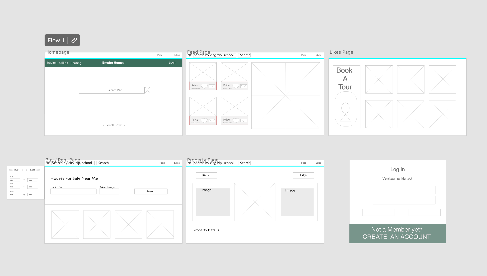

# Empire Homes

# Description

My app is called Empire Estate. It is a Real Estate Listing website for people looking to purchase a new home. Users can make filtered searches in any city they are looking to relocate and save property listings that are actively for sale on the market. In the future, I would like to add a messaging platform so users will be able to send messages and request appointments in the app.

# Planning Process

### User Stories

- As a user, I want to filter my searches, so that I can view properties with certain living features .

- As a user, I want to search available properties in different cities, so that I have a variety of options on places to move.

- As a user, I want to have view customer testimonials, so that I can feel confident in my choice of realty.

#### MVP Goals

- As a user, I want to a share button, so that I can email multiple people the house i'm interested in.

- As a user, I want to toggle light/dark mode, so that I reduce blue light exposure and help with eye strain that comes with prolonged screen time.

#### Stretch Goals

-  As a user, I want to save my favorite properties, so that I can easily access properties I want to schedule for a showing.

- As a user, I want to have a map view of the property , so that I can see surrounding businesses and landmarks.

### WireFrames

